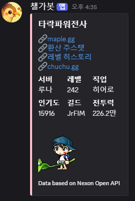
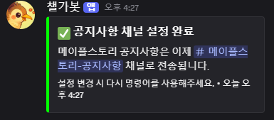
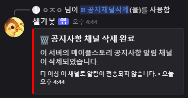
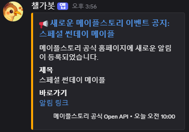
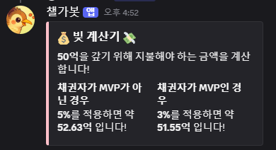
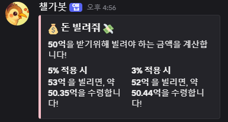

## 🎮 챌가봇 (Chal-Ga-Bot) - 디스코드 봇

안녕하세요! 챌가봇은 Discord 커뮤니티를 더 편리하고 즐겁게 만들어 줄 다기능 디스코드 봇입니다. 메이플스토리 게임 정보를 알려주고, 간단한 계산도 해줄 수 있습니다. **아직 개발 중**에 있습니다! 

ReadME update_date:`2025-06-29`

<p>혹시 이 프로젝트에 기여하고 싶으시다면 🤝Pull Request를 보내주세요!</p>

<p>

추가하면 좋을 아이디어가 있으시다면 [개발자 디스코드 채널](https://discord.gg/uJtREc3n)에서 편하게 얘기주셔도 좋습니다!

</p>

| [챌가봇 초대링크](https://discord.com/oauth2/authorize?client_id=1354793432601591848&permissions=8&integration_type=0&scope=bot+applications.commands) | [개발자 디스코드 채널](https://discord.gg/uJtREc3n) | 

## ✨ 주요 기능
챌가봇은 현재 다음과 같은 기능들을 제공합니다:


### 🧑‍💻 캐릭터 정보 조회:
메이플스토리 캐릭터의 레벨, 길드, 코디 등을 조회할 수 있습니다.


<table>
  <tr>
    <td align="center">명령어</td>
  </tr>
  <tr>
    <td></td>
  </tr>
  <tr>
    <td align="center">출력</td>
  </tr>
  <tr>
    <td></td>
  </tr>
</table>


### 📢 공지사항 알림:
넥슨 공식 API를 이용하여 메이플스토리의 새로운 공지사항이 올라올 때마다 설정된 디스코드 채널로 자동으로 알림을 보내줍니다.

GitHub Actions 자동화 도구를 이용하여 주기적으로 확인하여 알림을 전달합니다. 

아쉽지만 30분에 한번씩 체크합니다. 개선 예정입니다! 


<table>
  <tr>
    <td align="center" colspan='2'>명령어</td>
  </tr>
  <tr>
    <td align="center" colspan='2'></td>
  </tr>
  <tr>
    <td align="center" colspan='2'>출력</td>
  </tr>
  <tr>
    <td align="center">채널추가</td>
    <td align="center">삭제</td>
  </tr>
  <tr>
    <td></td>
    <td></td>
  </tr>
  <tr>
    <td align="center" colspan='2'>자동알림</td>
  </tr>
  <tr>
    <td align="center" colspan='2'></td>
  </tr>
</table>


### 🔢 간단한 계산기:
빚 가격 등 간단한 계산을 도와주는 기능입니다.

도입 예정:
`장부등록/ 장부계산 기능`

<table>
  <tr>
    <td align="center">명령어</td>
  </tr>
  <tr>
    <td></td>
  </tr>
  <tr>
    <td align="center">출력</td>
  </tr>
  <tr>
    <td></td>
  </tr>
</table>

<table>
  <tr>
    <td align="center">명령어</td>
  </tr>
  <tr>
    <td></td>
  </tr>
  <tr>
    <td align="center">출력</td>
  </tr>
  <tr>
    <td></td>
  </tr>
</table>

### ⭐ 스타포스 시뮬레이터(제작중):
실제 스타포스 확률과 동일한 강화를 수행합니다.(No 스타캐치/ No이벤트 기준)
`채널 별 High-Ranking 기능` : 해당 채널에서 가장 고강화 한 유저를 기록합니다!

도입 예정 이벤트 : 
`스타캐치/이벤트 선택 기능` 
`보유 메소/소모 메소 체크 기능`

<table>
  <tr>
    <td align="center">명령어</td>
  </tr>
  <tr>
    <td></td>
  </tr>
  <tr>
    <td align="center">출력</td>
  </tr>
  <tr>
    <td></td>
  </tr>
</table>

### (업데이트 예정) 📈 커뮤니티 단어 언급 랭킹:
디스코드 채널에서 특정 단어들이 지난 24시간 동안 얼마나 많이 언급되었는지 집계하여 랭킹을 보여줍니다.

우리 커뮤니티의 요즘 유행어는 무엇인지, 어떤 이야기가 가장 뜨거운지 한눈에 파악할 수 있게끔 제작 예정입니다!


## 💬 명령어 사용법
- 봇이 Discord 서버에 추가되면 다음 슬래시(/) 명령어를 사용할 수 있습니다.
    1. /캐릭터정보 [닉네임]:
        - 메이플스토리 캐릭터의 레벨, 길드, 코디 등 기본 정보를 조회합니다.
        - 예시: /캐릭터정보 닉네임:캐릭터명
    1. /공지채널설정 [채널]:
        - 메이플스토리 공지사항 알림을 받을 텍스트 채널을 설정합니다. (관리자 권한 필요)
        - 예시: /공지채널설정 #공지사항
        - 예시: /공지채널삭제
    1. /계산기 [빌린돈]:
        - 입력한 '빌린돈'에 대한 계산을 수행합니다.
        - 예시: /계산기 빌린돈:10
    1. /계산기 [돈빌려줘]:
        - 입력한 '돈빌려줘'에 대한 계산을 수행합니다.
        - 예시: /계산기 돈빌려줘:10
    1. /스타포스시뮬레이터:
        - 실제 스타포스 확률과 동일한 강화를 수행합니다.
        - 예시: /스타포스시뮬레이터
    1. /야구게임:
        - 야구게임입니다!
        - 예시: /야구게임
        - 예시: `123` `456` `789`

- (개발중) 미지원 명령어
    1. /단어랭킹:
        - 지난 24시간 동안 커뮤니티에서 가장 많이 언급된 특정 단어들의 랭킹을 보여줍니다.
        - 예시: /단어랭킹


## 🚀 챌가봇 제작과정

### 📋 사용 언어 & 패키지
- Node(22)
    - axios(^1.10.0)
    - cheerio(^1.1.0)
    - discord.js(^14.20.0)
    - djs-commander(^0.0.50)
    - dotenv (^16.5.0)
    - express (^5.1.0)
    - firebase (^11.9.1)
- Javascript
- CloudType.io
- Git
- [GitHub](https://github.com/Wjyuy)

#### 봇 설치 및 설정
1. Discord 봇 만들기 및 서버에 초대하기
    1. [Discord 개발자 포털](https://discord.com/developers/applications)으로 이동

    1. `New Application` 클릭하여 새로운 봇 이름 지정
    1. 왼쪽 메뉴에서 `Bot` 탭으로 이동
    1. `Add Bot` 클릭
    1. `Presence Intent`, `Server Members Intent`, `Message Content Intent` 활성화 (메시지 내용을 읽는 데 필요합니다!)
    1. `Reset Token` 버튼을 클릭하여 봇 토큰 복사. **이 토큰은 아주 중요하니 절대 외부에 노출하지 마세요!**
    1. 왼쪽 메뉴에서  `OAuth2` ->  `URL Generator` 탭으로 이동
    1. `SCOPES (권한 범위)`에서 `bot`과 `applications.commands` 선택
    1. `BOT PERMISSIONS (봇 권한)`에서 `Administrator` (관리자) 또는 최소한 `Read Messages/View Channels`, `Send Messages`, `Embed Links`, `Manage Channels` 권한을 선택합니다.
    1. 아래에 생성된 URL을 복사하여 웹 브라우저에 붙여넣으면, 봇을 원하는 디스코드 서버에 초대할 수 있습니다.

2. GitHub 저장소 설정

3. 환경 변수 설정 (.env 파일)
    - 프로젝트의 가장 중요한 비밀 정보들을 저장할 파일입니다.
    - .env라는 이름으로 프로젝트 루트 폴더에 파일 생성

    - `DISCORD_BOT_TOKEN`
`MAPLE_API`
`BOT_NOTIFICATION_SECRET`=아무 비밀 문자열(예시:my_super_secret_key_12345) GitHub Actions와 봇의 통신을 보호하는 비밀 키

4. GitHub Secrets 설정
    - GitHub Actions가 비밀 키를 안전하게 사용할 수 있도록 GitHub 저장소에 Secret 추가

    1. 여러분의 GitHub 저장소로 이동

    1. 상단 메뉴에서 Settings (설정) 탭을 클릭

    1. 왼쪽 사이드바에서 Security (보안) 아래의 **Secrets and variables -> Actions**를 클릭

    1. New repository secret (새 저장소 Secret) 버튼을 클릭하여 다음 3가지 Secret을 추가

    - MAPLE_API
        - Name: MAPLE_API
        - Value: .env 파일에 넣었던 넥슨 Open API 키를 여기에 다시 붙여넣습니다.
    - BOT_NOTIFICATION_SECRET
        - Name: BOT_NOTIFICATION_SECRET
        - Value: .env 파일에 넣었던 BOT_NOTIFICATION_SECRET와 동일한 비밀 문자열을 여기에 붙여넣습니다.
    - BOT_NOTIFICATION_URL
        - Name: BOT_NOTIFICATION_URL
        - Value: 이 봇이 배포될 주소(예: CloudType.io에서 봇에 할당된 주소)와 공지 알림을 받을 엔드포인트를 합친 주소입니다.

5. Firebase 프로젝트 및 Firestore 설정 
    - 공지사항 알림 기능을 위한 Discord 채널 ID를 저장할 데이터베이스
    - Firestore는 Google에서 제공하는 DB 

    1. [Firebase 콘솔](https://console.firebase.google.com/)에 로그인합니다.

    1. "프로젝트 추가"를 클릭하여 새 Firebase 프로젝트를 만듭니다. (예: 챌가봇-알림)

    1. 왼쪽 메뉴에서 Build (빌드) -> **Firestore Database**를 클릭합니다.

    1. "데이터베이스 만들기"를 클릭하고, **프로덕션 모드에서 시작**을 선택합니다.

    1. 데이터베이스 위치를 선택하고 데이터베이스를 생성합니다.

    1. Firestore Database 화면에서 `Rules (규칙) 탭`으로 이동합니다.

    1. 기존 규칙을 모두 지우고 다음 규칙으로 교체한 다음 `Publish (게시) 버튼`을 클릭합니다.

        ```
            rules_version = '2';
            service cloud.firestore {
            match /databases/{database}/documents {

            // 앱 설정 및 공지사항 정보 (봇만 접근)
            match /artifacts/{appId}/public/data/global_settings/{document=**} {
            allow read, write: if request.auth != null;
            }

            // 길드별 채널 설정 (봇만 접근)
            match /artifacts/{appId}/public/data/guild_settings/{guildId} {
            allow read, write: if request.auth != null;
            }
        }
        }
        ```

    1. 📦 필수 프로그램 설치
        - 프로젝트 폴더(터미널에서 cd [저장소_이름] 후)로 이동하여 필요한 모든 라이브러리를 설치합니다.
        - `npm install discord.js axios cheerio djs-commander dotenv express firebase`

1. ⚙️ 봇 실행 및 배포
    - 로컬에서 봇 실행하기 (개발/테스트용)
    - 모든 설정을 마쳤다면, 터미널에서 다음 명령어로 봇을 실행할 수 있습니다.

    - `node index.js`

    - 봇이 온라인 상태가 되고 [커맨드] 메시지 리스너가 활성화되었습니다. / [챌가봇온라인] 등 메시지가 보이면 성공!

1. CloudType.io에 배포하기
    - 챌가봇은 CloudType.io을 이용한 Node.js 호스팅 서비스에 배포하였습니다.

    1. CloudType.io에 로그인하여 새 서비스를 만듭니다.

    1. Node.js 서비스를 선택하고, 여러분의 GitHub 저장소를 연결합니다.

    1. CloudType.io의 "환경 변수" 설정에 .env 파일의 내용(DISCORD_BOT_TOKEN, MAPLE_API, BOT_NOTIFICATION_SECRET)을 동일하게 추가합니다.

    1. "실행 명령"은 node index.js로 설정합니다.

    1. 배포를 시작합니다. CloudType.io는 자동으로 여러분의 봇을 빌드하고 실행해 줄 것입니다.

#### 공지사항 기능 제작 과정
1. GitHub Actions (공지사항 알림 자동화)

    - 메이플스토리 공지사항 알림은 봇 서버가 아닌 GitHub Actions에서 실행되는 별도의 스크립트를 통해 이루어집니다.

        1. `.github/workflows/maplestory_announcement.yml` 파일 저장소 확인

        1. `maplestory_announcement_check.js` 파일이 저장소에 있는지 확인합니다.

        1. 위에서 설정한 `GitHub Secrets`(MAPLE_API, BOT_NOTIFICATION_URL, BOT_NOTIFICATION_SECRET)가 올바르게 설정되었는지 다시 확인합니다.

        1. GitHub 저장소에 코드 푸시: 이 파일들이 GitHub 저장소에 최신 상태로 푸시되어야 합니다.

        1. GitHub Actions 확인:

            1. GitHub 저장소의 Actions 탭으로 이동합니다.

            1. "MapleStory Announcement Checker"라는 워크플로우를 찾을 수 있습니다.

            1. Run workflow 버튼을 클릭하여 수동으로 실행해보거나, 5분마다 자동으로 실행될 때까지 기다립니다.

            1. 워크플로우 로그를 통해 스크립트가 잘 실행되고 공지사항을 확인하는지 볼 수 있습니다.


## 🤝 기여하기
이 프로젝트에 기여하고 싶다면 언제든지 Pull Request를 보내주세요! 새로운 기능 제안, 버그 수정 등 모든 기여를 환영합니다.

## 외부 사용 링크 및 출처
- [🔗maple.gg](https://maple.gg/)
- [🔗환산 주스탯](https://maplescouter.com)
- [🔗레벨 히스토리](https://maplehistory.kr)
- [🔗chuchu.gg](https://chuchu.gg)
- [Data based on Nexon Open API](https://openapi.nexon.com/ko/game/maplestory/)
